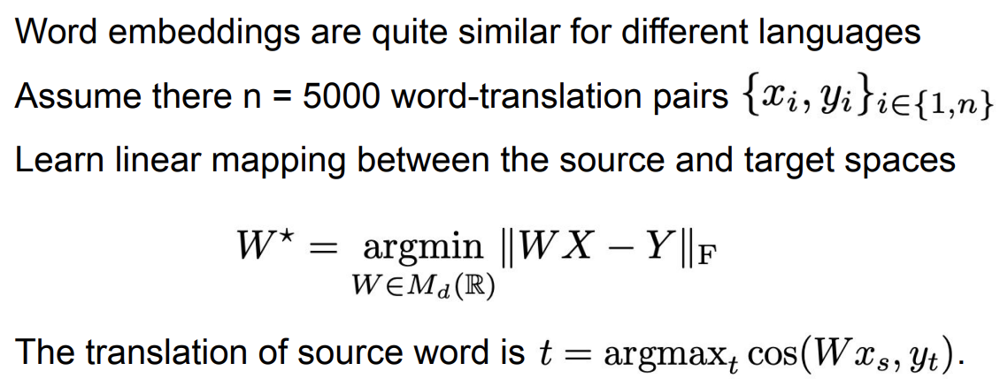
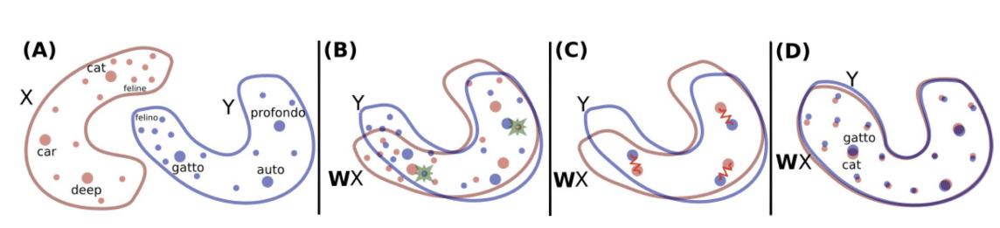

Lab assignment #1
Embedding-based Machine Translation:
  

📝 In this homework I made machine translation system without using parallel corpora, alignment, attention, 100500 depth super-cool recurrent neural network and all that kind superstuff.

**💡 Main idea:**

✅ As a result, a translation from Ukrainian to Russian was performed.